# **这个G1不太难 -- G1 GC详解**

[TOC]

## 垃圾收集基本概念

### **对象存活判定算法**

- #### 引用计数算法

给对象添加一个引用计数器，每当有一个地方引用它时，计数器值就加1；当引用失效时，计数器值就减1；任何时刻计数器为0的对象就是不可能再被使用的。

优点：实现简单、判定效率也很高；

缺点：它很难解决对象之间互相循环引用的问题。

- #### 可达性分析算法

这个算法的基本思想就是通过一系列的称为&quot;GC Roots&quot;的对象作为起始点，从这些节点开始向下搜索，搜索所走过的路径称为引用链（Reference Chain），当一个对象到GC Roots没有任何引用链相连（用图论的话来说，就是从GC Roots到这个对象不可达）时，则证明此对象是不可用的。

### **经典垃圾收集算法**

- #### 标记-清除（Mark-Sweep）算法

标记-清除算法是最基础的垃圾收集算法。正如其名字描述的那样，该算法分为两个阶段：&quot;标记&quot;和&quot;清除&quot;。首先标记出所有可以被回收的对象，然后经过一轮垃圾回收将所有被标记的对象的内存空间释放，即清除可被回收的对象。

该算法的优点是逻辑简单，最初想到的垃圾收集算法就是这种。之后的收集算法都是针对该算法的不足进行改进而产生的新算法。该算法主要存在两种不足：一是标记和清除两个阶段都比较低效；二是这种算法虽然收回了内存，但是容易导致内存中有大量的不连续的小的内存区域（内存碎片）。当有一个大的对象需要创建时，可能出现虽然总的可用内存很多，但是没有一个连续的大的内存空间来存放大对象的情况，从而导致了过早的再一次GC。

- #### 复制（Copying）算法

为了解决标记-清除算法效率低以及内存碎片的问题，出现了复制算法。该算法的思想是将整个内存空间分为两个大小相同的空间。同一时期只在一个内存空间上创建对象，当该部分内存满了之后，执行垃圾回收。垃圾回收的过程：首先将不能回收的依然可用的对象复制到另一个内存空间上，然后将之前的一个内存空间直接清空。经过该轮垃圾回收后，之前的一个内存空间对象被全部清空了，活着的对象被复制到了另一个内存空间上，此时再创建对象就在另一个内存空间上分配空间了。

该算法的优点是逻辑简单，执行高效。但缺点是实际只使用了一半的可用内存，浪费了一半的内存。

- #### 标记-整理算法（Mark-Compact）

复制算法对于对象存活率很低的情况是高效的，但是当对象的存活率非常高时，就变得非常低效了。在老年代中，对象的存活率很高，所以不能使用复制算法。于是根据老年代的对象特点，提出了标记-整理（Mark-Compact）算法。标记-整理算法也分为两个阶段：标记和整理。第一个阶段与标记-清除算法一样：标记出所有可以被回收的对象。第二个阶段不再是简单的清除无用对象的空间，而是将后面存活的对象依次向前移动。将所有存活的对象都移动成内存空间中前段连续的一个区域，之后的连续的区域都是可分配的没有使用的内存空间。

- #### STW（ Stop-the-world）

在JVM中指停止一切Java应用线程（用户线程）。

- #### HotSpot的部分算法细节

可达性分析算法中，需要先枚举根节点。枚举根节点时，需要STW，避免在分析引用关系时，根节点集合的对象引用关系还在不断变化。为了查找到引用类型，HotSpot使用一组称为OopMap的数据结构来存放对象引用关系，使得收集器在扫描时就可以得知这些信息，不需要一个不漏地从方法区等GC Roots开始查找区分内存里的数据是什么类型。

由于可以导致引用关系变化，间接导致OopMap变化的指令有很多，所以HotSpot没有为每条指令都生成OopMap，只在&quot;特定的位置&quot;记录这些信息，这些位置被称为 **安全点（Safepoint）** 。用户线程运行到安全点时，才能确保产生的引用关系变化被垃圾收集器识别，因此必须运行到安全点才能STW。安全点的选定不能太少以至于让收集器等待时间过长，也不能太多以至于过分增大内存消耗，选定的标准是&quot;具有让程序长时间执行的特征&quot;，明显具有这个特征的是指令序列的复用，例如方法调用、循环跳转、异常跳转等，只有具有这些功能的指令才会产生安全点。

安全点机制保证了用户线程执行时，在不太长的时间内就会遇到可进入垃圾收集过程的安全点，但用户线程不执行，即没有分配到处理器时间的时候，无法走到安全点中断挂起自己，虚拟机显然不可能持续等待线程重新被激活分配处理器时间。这就需要引入 **安全区域（Safe Region ）** 来解决。

安全区域能够确保在某一段代码片段中，引用关系不会发生变化，因此，在这个区域里的任何地方开始垃圾收集都是安全的，可以把安全区域看作扩展拉伸了的安全点。线程执行到安全区域里的代码时，如果虚拟机在进行根节点枚举，则线程会等待，直到根节点枚举结束。

为了解决跨代引用的问题，垃圾收集器在新生代中建立了名为 **记忆集（ Remembered Set ）** 的数据结构，用以避免把整个老年代加进GC Roots扫描范围。收集器需要通过记忆集判断出某一块非收集区域是否存在有指向待收集区域的指针。记忆集的实现形式通常是 **卡表（ Card Table ）** ，HotSpot虚拟机里的卡表是一个数组，里面的每一个元素对应一块内存块，称之为 **卡页（ Card Page ）** ，卡页内有对象含有跨代指针。如果卡页内有一个或多个对象的字段存在着跨代指针，那就将卡表里对应这个卡页的元素标记为1，称这个元素变脏 **（ Dirty ）** ，没有则标识为0。在垃圾收集发生时，只要筛选出卡表中变脏的元素，就可以得出哪些卡页中包含跨代指针，然后把它们加入GC Roots中一并扫描。

HotSpot虚拟机是通过 **写屏障（ Write Barrier ）** 技术维护卡表状态的。写屏障可以看作虚拟机层面对&quot;引用类型字段赋值&quot;这个动作的AOP切面，在引用对象赋值时会产生一个环形通知，供程序执行额外的动作，也就是说赋值前后都能利用写屏障做额外的操作。

## G1简介

经典的垃圾收集器主要有三种类型：串行收集器、并行收集器和并发标记清除收集器，这三种收集器分别可以是满足Java应用三种不同的需求：内存占用及并发开销最小化、应用吞吐量最大化和应用GC暂停时间最小化，但是，上述三种垃圾收集器都有几个共同的问题：

1. 所有针对老年代的操作必须扫描整个老年代空间；
2. 新生代和老年代是独立的连续的内存块，必须先决定年轻代和老年代在虚拟地址空间的位置。

G1（Garbage First）回收器能解决上述两个问题（JDK1.7中正式推出），它将Java堆划分成了多个大小相等的 **分区（ Heap Region ）** ，每个分区可以根据需要扮演新生代的Eden空间、Survivor空间，或者老年代空间，进行垃圾回收前会先确定一个 **待收集集合（ Collection Set ， CSet ）** ，CSet可能包括新生代和老年代的分区。

G1收集器将分区作为单次回收的最小单元，即每次收集到的内存空间都是分区大小的整数倍，这样可以有计划地避免在整个Java堆中进行全区域的垃圾收集，停顿时间因此能得到较好的控制。G1收集器有一个停顿预测模型，它会追踪每一个分区的回收价值，根据设定的预期系统停顿时间，来选择回收用时最短和回收对象最多的分区进行垃圾回收，保证每次回收都是最有效的回收。如果需要被回收的对象很多，为保证对用户线程停顿的影响在可控范围内，G1会采取分批回收的策略，尽量保证单次服务停顿满足要求。

## G1基本概念

### **分区（ Heap Region ， HR ）**

或称 **堆分区** ，是G1堆和操作系统交互的最小管理单位。G1的分区类型大致可以分为四类：自由分区（Free Heap Region，FHR）、新生代分区（Young Heap Region，YHR）、老年代分区（Old Heap Region，OHR）。其中新生代分区又可以分为Eden（存放新分配的对象）和Survivor（存放上一次垃圾收集存活下来的对象）。G1中大对象（超过HR大小一半的对象）不使用新生代空间，直接进入老年代。

HR的大小直接影响对象分配和垃圾回收的效率。如果HR过大，一个HR可以存放多个对象，分配效率高，但是回收时间过长；如果HR太小则导致分配效率低下。为了达到分配效率和清理效率的平衡，HR有一个上限和下限值，目前上限是32MB，下限是1MB（下限可能会被修改，HR的大小只能是1MB、2MB、4MB、8MB、16MB和32MB）。HR可以由以下方式确定：

1. 可以通过参数G1HeapRegionSize来指定大小，这个参数的默认值为0；
2. 启发式推断，即在不指定HR大小的时候，由G1启发式地推断HR大小。

堆分区数量可以扩展。按照默认值计算，G1可以管理的最大内存为2048\*32MB=64GB。假设设置xms=32G，xmx=128G，则每个堆分区的大小为32M，分区个数动态变化范围从1024到4096个。

### **G1 停顿预测模型**

G1是个响应时间优先的GC算法，用户可以设定整个GC过程的期望停顿时间，由参数MaxGCPauseMillis控制，默认值200ms。不过它不是硬性条件，只是期望值，G1会努力在这个目标停顿时间内完成垃圾回收工作，但是它不能保证一定会及时完成。

G1依靠停顿预测模型来满足用户的期望停顿时间。G1根据这个模型统计计算出来的历史数据来预测本次收集需要选择的堆分区，从而尽量满足用户的目标停顿时间。

### **G1 的三种回收算法简介**

- #### 新生代回收（Young GC，YGC）

当内存分配的时候，剩余空间不能满足要分配的对象时就会优先触发新生代回收。年轻代回收只收集YHR。

- #### 混合回收（Mixed GC）

混合回收会回收YHR和部分OHR，会先执行并发标记过程标记出待收集对象，再执行垃圾回收，垃圾回收的步骤和YGC一致（唯一的区别就是多了一部分垃圾多的老生代分区）。

- #### 整堆回收（Full GC）

整个堆的垃圾回收动作，通常Full GC是串行收集的。G1的Full GC不仅有串行实现，在JDK10中还有并行实现。

### **记忆集（ Remembered Set ， RSet ）**

G1中用RSet来记录不同代际之间的引用关系，目的是为了加快垃圾回收的速度。通常有两种方法记录引用关系，分别为Point Out和Point In。比如a=b（a引用b），若采用Point Out结构，则在a的RSet中记录b的地址；若采用Point In结构，则在b的RSet中记录a的地址。Point Out记录操作简单，但是需要对RSet做全部扫描；Point In记录操作复杂，但是在标记扫描时直接可以找到有用和无用的对象，不需要额外的扫描，因为RSet里面的对象可以认为就是根对象。G1的RSet采用了Point In结构，即谁引用了我。

RSet存在如下缺点：

1. RSet需要额外的内存空间来存储这些引用关系，一般是JVM最大的额外开销的1%-20%之间；
2. RSet中的对象可能已经死亡，这个时候被引用的对象还是会被认为是活跃对象，实际上它是浮动垃圾；

因此需要对RSet进行优化，削减对引用关系的记录，具体思路如下：

1. 分区内部的引用

无需记录。无论是新生代还是老年代的分区内部的引用，都不需要记录引用关系。因为是针对一个分区进行的垃圾回收，要么这个分区被回收，要么不被回收。

2. 新生代引用新生代

无需记录。G1的三种回收算法（YGC/Mixed GC/Full GC）都会全量处理新生代分区，所以新生代都会被遍历到。因此无需记录这种引用关系。

3. 新生代引用老年代

无需记录。G1的YGC回收新生代，无需这个引用关系。混合GC时，G1会采用新生代分区作为根，那么在遍历新生代分区时就能找到老年代分区了，无需这个引用关系。对于Full GC来说，所有分区都会被处理，也无需这个引用关系。

4. 老年代引用新生代

需要记录。YGC在回收新生代时，如果新生代的对象被老年代引用，那么需要标记为存活对象。即此时的根对象有两种，一个是栈空间/全局变量的引用，一个是老年代到新生代的引用。

5. 老年代引用老年代

需要记录。混合GC时，只会回收部分老年代，所以必须记录引用关系，快速找到哪些对象是活跃的。

## G1的主要收集过程

G1的回收过程可能有4个阶段：

1. 新生代回收
2. 并发标记
3. 混合回收
4. 如果需要，可能会进行Full GC

### **新生代回收（ Young GC ， YGC ）**

YGC主要分为两部分：并行部分和其他部分。主要步骤如下：

1. 进行收集前需要STW。
2. 选择要收集的CSet，对于YGC来说整个新生代分区就是CSet。
3. 进入并行任务处理：
     1. 根扫描并处理：处理过程会把根直接引用的对象复制到新的Survivor区，然后把被引用对象的field入栈等待后续的复制处理。
     2. 处理老生代到新生代分区的引用：首先会更新RSet，然后从RSet出发，把RSet所在卡表对应的分区内存块中所有的对象都认为是根，把这些根引用的对象复制到新的Survivor区，然后把被引用对象的field入栈等待后续的复制处理。
     3. JIT代码扫描。
     4. 根据栈中的对象，进行深度递归遍历复制对象。
4. 其他任务处理，包括字符串去重优化回收（JDK8引入的功能）、重构RSet、释放CSet、尝试大对象回收、尝试扩展内存、调整新生代分区数目（主要是根据GC的执行时间和目标停顿时间预测下次可能发生垃圾回收时能接受的最大分区数）等，如果使用内存超过一定阈值，还会启动并发标记（用于混合回收）。

回收完成后，新生代分区存活的对象转移到了Survivor区，还有部分晋升到老年代。

### **混合回收（ Mixed GC ）**

混合回收可以总结为两个阶段：

1. 并发标记，目的是标记老生代分区中的活跃对象，并计算分区中垃圾对象所占空间的多少，用于垃圾回收过程中判断是否回收分区，被标记的不需要回收。
2. 垃圾回收，这个过程和新生代回收的步骤一致，唯一的区别是回收时不仅仅回收新生代分区，同时回收并发标记中识别到的垃圾多的老生代分区。

并发标记指的是标记线程和用户线程并发运行。并发标记的时候，标记线程标记垃圾对象的同时，用户线程可能还在生成垃圾对象，G1将标记过程中用户线程新生成的对象都认为是存活的，那么如何识别哪些对象是用户线程新生成的呢？在堆分区中分配对象的时候，对象都是连续分配，所以G1在分区里设计了几个指针，这些指针分别是Bottom、Prev TAMS（以下简称Prev）、Next TAMS（以下简称Next）和Top，TAMS指的是Top-at-Mark-Start，用Prev指针指向上一次并发处理后的地址，用Next指向并发标记开始之前内存已经分配成功的地址，当并发标记开始之后，用Bottom表示分区的底部，用Top表示分区的顶部。两个TAMS指针如果有新的对象分配，可以移动Top指针，使Top指针指向当前内存分配成功的地址。Next和Top指针之间的地址就是用户线程新增的对象使用的地址。如果我们假设Prev指针之前的对象已经标记成功，在并发标记的时候从根出发，不仅仅标记Prev和Next之间的对象，还标记了Prev指针之前活跃的对象。当并发标记结束之后，只需要把Prev指针设置为Next指针即可开始新一轮的标记处理。

Prev和Next指针解决了并发标记工作内存区域的问题，还需要再引入两个额外的数据结构来记录内存标记的状态，典型的是使用位图来指示哪块内存已经使用，哪块内存还未使用。所以并发标记引入两个位图PrevBitmap和NextBitmap，用PrevBitmap记录Prev指针之前内存的标记状况（这是为了防止标记失败后之前所有内存的标记状况都丢失，然后导致需要重新从头开始标记），用NextBitmap记录Next指针之前内存的标记状况。

并发标记会从根对象出发开始进行并发标记，第一次标记时PrevBitmap为空，NextBitmap待标记，如图1所示：

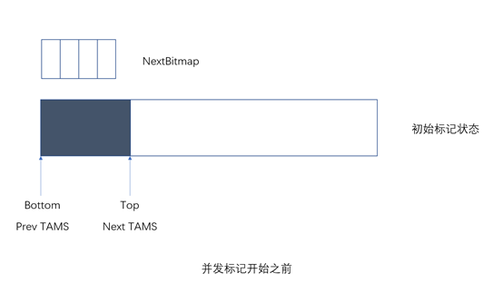

<center> 图 1 并发标记开始之前 </center>

并发标记结束后，NextBitmap标记了分区对象存活的情况，如图2所示。假定图2的位图中黑色区域表示堆分区中对应的对象还活着。在并发标记的同时用户线程继续运行，所以Top会继续增长。

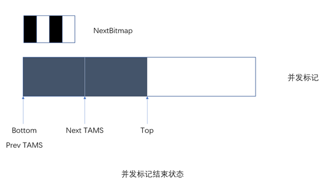

<center>图2 并发标记结束状态</center>

随后第二轮的并发标记开始，交换位图，重置指针，如图3和图4所示：

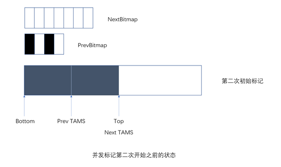

<center>图3 并发标记第二次开始之前的状态</center>

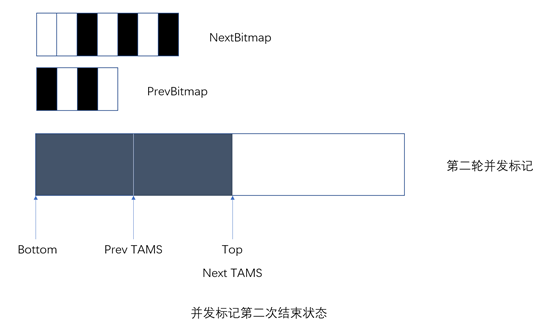

<center>图4 并发标记第二次结束状态（此处假定用户线程没有分配新对象了）</center>

SATB通过以上的设计解决了并发标记过程中新生成对象的识别问题，但还有一个问题需要解决。垃圾回收器在标记对象的过程中，用户线程可能正在改变对象引用关系，从而造成 **错标** 和 **漏标** 。错标不会影响程序的正确性，只是增加了浮动垃圾。但漏标会导致可达对象被当作垃圾收集掉，从而影响程序的正确性。因此标记线程需要避免漏标，但在了解如何避免漏标之前，需要先了解标记过程。为了区分对象的不同状态，在标记时引入了 **三色标记法** 。

三色标记法将对象分成如下几种：

- **白色：** 表示还没被收集器扫描过。在可达性分析刚开始的阶段，所有对象都是白色的，如果在结束时对象还是白色，则说明这个对象不可达，需要被收集。
- **灰色：** 包含可以从根访问的所有对象，对象自身已经被扫描，但至少存在一个field字段引用的对象还没被收集器扫描。由于已知它们是从根部可以访问的，因此无法对其进行垃圾收集，并且在扫描后将其变为黑色。
- **黑色：** 表示对象自身已经被标记，且拥有的field字段引用的对象都已经被扫描过，它是安全存活的，不会被收集。

黑色集一开始为空，灰色集是直接从根引用的对象集，而白色集包括所有其他对象。三色标记法的详细步骤如下：

1. 从灰色集中选择一个对象，然后将其移至黑色集。
2. 将其引用的每个白色对象移至灰色集。这样可以确保该对象及其引用的任何对象都不能被垃圾回收。
3. 重复最后两个步骤，直到灰色集为空。

灰色集为空时，扫描完成；否则，扫描结束。黑色对象可以从根部到达，而白色对象则不能，并且可以进行被垃圾收集器收集。

由于所有无法从根部立即到达的对象都被添加到白色集中，并且对象只能从白色集移动到灰色集，从灰色集移动到黑色集，因此三色标记算法保留了一个重要的特性——没有黑色对象引用白色对象。这样可以确保一旦灰色集为空，就可以回收白色集。

回到如何避免漏标的问题，要避免漏标，需要先了解漏标的条件。对象在并发标记阶段会被漏标的充分必要条件是：

1. 赋值器插入了一条或多条从黑色对象到白色对象的新引用；
2. 赋值器删除了全部从灰色对象到该白色对象的直接或间接引用。

因此，要避免对象的漏标，只需要打破以上两个条件中的任意一个即可。所以在并发标记的时候也对应地有两种不同的实现：

1. **增量更新（ Incremental Update ）：** 破坏第一个条件。当黑色对象插入新的指向白色对象的引用关系时，就将这个新插入的引用记录下来，等并发标记结束后，再以这些记录过的引用关系中的黑色对象为根，重新扫描一次。这可以简化理解为，黑色对象一旦新插入了指向白色对象的引用之后，它就变回灰色对象了。
2. **原始快照（ Snapshot At The Beginning ， SATB ）：** 破坏第二个条件。当灰色对象要删除指向白色对象的引用关系时，就将这个白色对象记录下来，之后再以这些被记录的白色对象为根重新标记一遍。

具体过程如下列图所示：

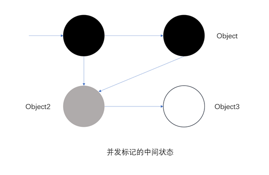

<center>图5 并发标记的中间状态</center>

图5中有四个对象，Object和Object2都可以从根对象到达。Object已经被标记，而且包含的field引用的对象也已经被标记，所以被设置为黑色；Object2已经被标记，但它包含的field还处于待扫描状态，所以为灰色；Object3还没有被扫描，所以为白色。箭头代表引用关系，比如Object中的field引用了Object2。

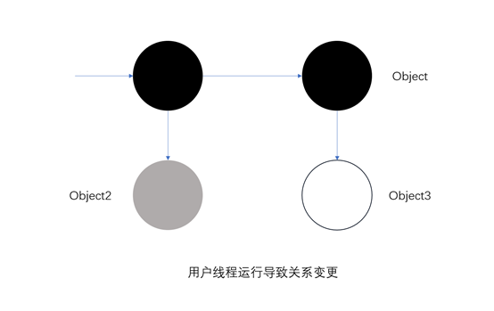

<center>图6 用户线程运行导致关系变更</center>

图6中，并发标记线程让出cpu，让用户线程执行并修改了引用关系。Object2的field变为空引用，Object的field指向Object3，不再指向Object2。由于Object2的filed已经为空，所以不需要处理，但Object3不处理的话就会导致漏标，所以需要增量更新或者SATB更新来处理这种情况。

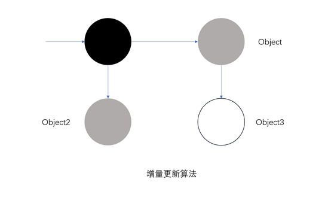

<center>图7 增量更新算法</center>

如果采用增量更新算法，Object将被重新标记为灰色，这意味着Object的field需要被再次处理一遍，如图7所示。

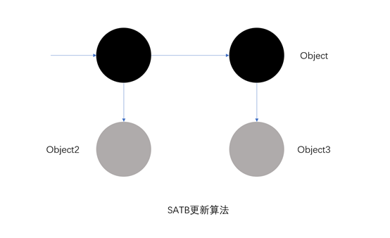

<center>图8 SATB更新算法</center>

如果采用SATB算法，在Object2的field被置为空之前，Object3会被置为灰色，后续会对Object3进行扫描，如图8所示。

增量更新和SATB都利用了写屏障来实现对引用关系变化的记录，两种方法都有实际应用，比如CMS是基于增量更新做并发标记的，G1则基于SATB做并发标记。

混合回收的并发标记实际上分为五个子阶段：

**阶段**  **1:**  **初始标记 (Initial Mark)**

暂停所有应用线程，并发地进行标记从 GC Root 开始直接可达的对象（原生栈对象、全局对象、JNI 对象），当达到触发条件时，G1 并不会立即发起并发标记周期，而是等待下一次新生代收集，利用新生代收集的 STW 时间段，完成初始标记。

**阶段**  **2:**  **根区域扫描（ Root Region Scan ）**

在初始标记暂停结束后，新生代收集也完成的对象复制到 Survivor 的工作，应用线程开始活跃起来，此时为了保证标记算法的正确性，所有新复制到 Survivor 分区的对象，需要找出哪些对象存在对老年代对象的引用，把这些对象标记成根(Root)。这个过程称为根分区扫描（Root Region Scanning），同时扫描的 Suvivor 分区也被称为根分区（Root Region）。根分区扫描必须在下一次新生代垃圾收集启动前完成（接下来并发标记的过程中，可能会被若干次新生代垃圾收集打断），因为每次 GC 会产生新的存活对象集合。

**阶段**  **3:**  **并发标记（ Concurrent Marking ）**

标记线程与应用程序线程并行执行，标记各个堆中Region的存活对象信息，这个步骤可能被新的 Young GC 打断。所有的标记任务必须在堆满前就完成扫描，如果并发标记耗时很长，那么有可能在并发标记过程中，又经历了几次新生代收集。

**阶段**  **4:**  **再次标记 (Remark)**

短暂地停止应用线程, 标记在并发标记阶段引用发生变化的对象，和所有未被标记的存活对象，同时完成存活数据计算。

**阶段**  **5:**  **清理 (Cleanup)**

为即将到来的转移阶段做准备, 此阶段也为下一次标记执行所有必需的整理计算工作：整理更新每个Region各自的RSet，回收不包含存活对象的分区（包含存活对象的待回收分区会在之后的垃圾回收步骤进行回收），统计计算回收收益高（基于释放空间和暂停目标）的老年代分区集合。

### **整堆回收（ Full GC ）**

Full GC会对整个堆进行收集，在JDK10以前的Full GC是串行执行的，这会导致非常长的STW，导致Full GC的常见原因如下：

1. 程序主动执行System.gc()。
2. 全局并发标记期间老年代空间被填满（并发模式失败）。
3. Mixed GC期间老年代空间被填满（晋升失败）。
4. Young GC时Survivor空间和老年代没有足够空间容纳存活对象。

G1里的Full GC主要分为5步：

1. 标记活跃对象（和YGC的标记处理类似）。
2. 计算对象的新地址。
3. 把所有的引用都更新到新的地址上。
4. 移动对象完成空间的压缩。
5. 后处理：尝试调整堆空间大小，重构RSet，调整新生代大小。

JDK10里还有G1 Full GC的并行实现，标记过程类似于并发标记，但比并发标记简单，因为已经STW了，所以不涉及SATB的处理。

## G1日志分析

需要在应用程序启动参数里添加：

-XX:+UseG1GC -XX:+PrintGCDetails -XX:+UnlockExperimentalVMOptions -XX:G1LogLevel=finest -XX:+PrintGCTimeStamps

### **YGC 日志分析**

/\* 从JVM启动到当前时间的相对时间0.425s（可以通过设置-XX:+PrintGCDateStamps显示GC发生时的时间戳），收集的类型为G1 Evacuation Pause (young)，也就是G1新生代GC，垃圾收集消耗的总时长为0.0037665s \*/

```java
0.425: [GC pause (G1 Evacuation Pause) (young), 0.0037665 secs]
```

/\* 并行gc线程，一共有8个 \*/

```java
[Parallel Time: 3.4 ms, GC Workers: 8]
```

/\* 这一行信息说明的是这8个线程相对于JVM启动的开始时间，Min表示最早开始的线程时间，Avg表示平均开始时间，Max表示的是最晚开始时间，Diff为最早和最晚的时间差（这个值越大说明线程启动时间越不均衡）。线程启动的时间依赖于GC进入安全点的情况。\*/

```java
[GC Worker Start (ms): 424.6 424.6 424.6 424.6 424.6 424.7 424.7 424.9
 
Min: 424.6, Avg: 424.7, Max: 424.9, Diff: 0.2]
```

/\* 外部根区(堆外区，线程栈根，JNI，全局变量，系统目录，classloader等)扫描消耗时间 \*/

```java
[Ext Root Scanning (ms): 0.2 0.2 0.2 0.2 3.3 0.1 0.1 0.0
 
Min: 0.0, Avg: 0.5, Max: 3.3, Diff: 3.3, Sum: 4.3]
```

/\* Java线程的根处理时间，主要是线程栈。这个时间包含了根直接引用对象的复制时间，如果规模超大，这个时间可能会增加 \*/

```java
[Thread Roots (ms): 0.0 0.0 0.2 0.1 3.3 0.1 0.0 0.0
 
Min: 0.0, Avg: 0.5, Max: 3.3, Diff: 3.3, Sum: 3.6]
```

```java
[StringTable Roots (ms): 0.0 0.1 0.0 0.1 0.0 0.1 0.1 0.0

Min: 0.0, Avg: 0.1, Max: 0.1, Diff: 0.1, Sum: 0.5]

[Universe Roots (ms): 0.0 0.0 0.0 0.0 0.0 0.0 0.0 0.0

Min: 0.0, Avg: 0.0, Max: 0.0, Diff: 0.0, Sum: 0.0]

[JNI Handles Roots (ms): 0.0 0.0 0.0 0.0 0.0 0.0 0.0 0.0

Min: 0.0, Avg: 0.0, Max: 0.0, Diff: 0.0, Sum: 0.0]

[ObjectSynchronizer Roots (ms): 0.0 0.0 0.0 0.0 0.0 0.0 0.0 0.0

Min: 0.0, Avg: 0.0, Max: 0.0, Diff: 0.0, Sum: 0.0]

[FlatProfiler Roots (ms): 0.0 0.0 0.0 0.0 0.0 0.0 0.0 0.0

Min: 0.0, Avg: 0.0, Max: 0.0, Diff: 0.0, Sum: 0.0]

[Management Roots (ms): 0.0 0.0 0.0 0.0 0.0 0.0 0.0 0.0

Min: 0.0, Avg: 0.0, Max: 0.0, Diff: 0.0, Sum: 0.0]

[SystemDictionary Roots (ms): 0.0 0.0 0.0 0.0 0.0 0.0 0.0 0.0

Min: 0.0, Avg: 0.0, Max: 0.0, Diff: 0.0, Sum: 0.0]

[CLDG Roots (ms): 0.2 0.0 0.0 0.0 0.0 0.0 0.0 0.0

Min: 0.0, Avg: 0.0, Max: 0.2, Diff: 0.2, Sum: 0.2]

[JVMTI Roots (ms): 0.0 0.0 0.0 0.0 0.0 0.0 0.0 0.0

Min: 0.0, Avg: 0.0, Max: 0.0, Diff: 0.0, Sum: 0.0]
```

/\* CodeCache Roots实际上是在处理RSet的时候的统计值，它包含后面的UpdateRS，ScanRS和Code Root Scanning \*/

```java
[CodeCache Roots (ms): 0.0 0.0 0.8 0.0 0.0 0.0 0.0 0.0

Min: 0.0, Avg: 0.1, Max: 0.8, Diff: 0.8, Sum: 0.8]
```

```java
[CM RefProcessor Roots (ms): 0.0 0.0 0.0 0.0 0.0 0.0 0.0 0.0

Min: 0.0, Avg: 0.0, Max: 0.0, Diff: 0.0, Sum: 0.0]

[Wait For Strong CLD (ms): 0.0 0.0 0.0 0.0 0.0 0.0 0.0 0.0

Min: 0.0, Avg: 0.0, Max: 0.0, Diff: 0.0, Sum: 0.0]

[Weak CLD Roots (ms): 0.0 0.0 0.0 0.0 0.0 0.0 0.0 0.0

Min: 0.0, Avg: 0.0, Max: 0.0, Diff: 0.0, Sum: 0.0]

[SATB Filtering (ms): 0.0 0.0 0.0 0.0 0.0 0.0 0.0 0.0

Min: 0.0, Avg: 0.0, Max: 0.0, Diff: 0.0, Sum: 0.0]
```

/\* 表示GC线程更新RSet的时间花费，在每次开始收集之前都要进行Rset更新，保证RSet是最新的 \*/

```java
[Update RS (ms): 0.0 0.0 0.0 0.0 0.0 0.0 0.0 0.0

Min: 0.0, Avg: 0.0, Max: 0.0, Diff: 0.0, Sum: 0.0]

[Processed Buffers: 0 0 0 0 0 0 0 0

Min: 0, Avg: 0.0, Max: 0, Diff: 0, Sum: 0]
```

/\* 扫描RSet找到被引用的对象所花费的时间 \*/

```java
[Scan RS (ms): 0.0 0.0 0.0 0.0 0.0 0.0 0.0 0.0

Min: 0.0, Avg: 0.0, Max: 0.0, Diff: 0.0, Sum: 0.0]

[Code Root Scanning (ms): 0.0 0.0 0.8 0.0 0.0 0.0 0.0 0.0

Min: 0.0, Avg: 0.1, Max: 0.8, Diff: 0.8, Sum: 0.8]
```

/\* 所有活着的对象复制到新的分区花费的时间（不包括根直接引用的对象的复制，这些对象在根处理时已经复制过了） \*/

```java
[Object Copy (ms): 2.8 2.8 2.1 2.8 0.0 2.8 2.8 2.8

Min: 0.0, Avg: 2.4, Max: 2.8, Diff: 2.8, Sum: 18.9]
```

/\* 当一个GC Worker结束工作后，会尝试终止，但在终止之前它会尝试帮其他线程完成未完成的任务。结束时间指的就是这个线程结束收集到真正结束的时间差 \*/

```java
[Termination (ms): 0.3 0.4 0.3 0.3 0.0 0.3 0.4 0.4

Min: 0.0, Avg: 0.3, Max: 0.4, Diff: 0.4, Sum: 2.4]
```

/\* 每个线程尝试终止的次数 \*/

```java
[Termination Attempts: 4 1 2 3 1 3 1 1

Min: 1, Avg: 2.0, Max: 4, Diff: 3, Sum: 16]
```

/\* 并行处理时其他处理所花费的时间，通常是由于JVM析构释放资源 \*/

```java
[GC Worker Other (ms): 0.0 0.0 0.0 0.0 0.0 0.0 0.0 0.0

Min: 0.0, Avg: 0.0, Max: 0.0, Diff: 0.0, Sum: 0.2]
```

/\* 每个并行回收线程的时间统计 \*/

```java
[GC Worker Total (ms): 3.4 3.4 3.4 3.4 3.4 3.3 3.3 3.1

Min: 3.1, Avg: 3.3, Max: 3.4, Diff: 0.2, Sum: 26.7]
```

/\* GC相对于JVM启动时的结束时间，diff表示第一个和最后一个线程结束时间的差值，越小越好 \*/

```java
[GC Worker End (ms): 428.0 428.0 428.0 428.0 428.0 428.0 428.0 428.0

Min: 428.0, Avg: 428.0, Max: 428.0, Diff: 0.0]
```

/\* 遍历那些指向CSet的方法，修正在GC中产生变动的引用 \*/

```java
[Code Root Fixup: 0.0 ms]
```

/\* 清理code root table \*/

```java
[Code Root Purge: 0.0 ms]
```

/\* 清除卡表的时间 \*/

```java
[Clear CT: 0.1 ms]
```

```java
[Other: 0.3 ms]
```

/\* 选择CSet的时间，YGC是0（YGC将所有新生代分区作为CSet，不需要额外的计算来选择） \*/

```java
[Choose CSet: 0.0 ms]
```

/\* 弱引用对象处理的时间（包括SoftReference、WeakReference、FinalReference、PhantomReference以及JNI Weak Reference），可以并行处理 \*/

```java
[Ref Proc: 0.1 ms]
```

/\* 将弱引用放到待处理列表（pending list）的时间 \*/

```java
[Ref Enq: 0.0 ms]
```

/\* 重构RSet花费的时间 \*/

```java
[Redirty Cards: 0.1 ms]
```

```java
[Parallel Redirty: 0.0 0.0 0.0 0.0 0.0 0.0 0.0 0.0

Min: 0.0, Avg: 0.0, Max: 0.0, Diff: 0.0, Sum: 0.0]

[Redirtied Cards: 96 0 0 0 0 0 0 0

Min: 0, Avg: 12.0, Max: 96, Diff: 96, Sum: 96]
```

/\* 这表示需要多长时间来评估这些巨型区域是否是迫切需要回收和记录的候选区域。有效的候选对象没有强代码根，记忆集中只有稀疏条目。 \*/

```java
[Humongous Register: 0.0 ms]
```

/\* 大对象总个数 \*/

```java
[Humongous Total: 0]
```

/\* 可回收的大对象个数 \*/

```java
[Humongous Candidate: 0]
```

/\* 大对象回收、释放区域、重置区域类型以及将区域添加到到空闲列表所花费的时间 \*/

```java
[Humongous Reclaim: 0.0 ms]
```

/\* 回收的大对象个数 \*/

```java
[Humongous Reclaimed: 0]
```

/\* 释放CSet中的分区花费的时间 \*/

```java
[Free CSet: 0.0 ms]
```

/\* 释放CSet中新生代的分区花费的时间 \*/

```java
[Young Free CSet: 0.0 ms]
```

/\* 释放CSet中老生代的分区花费的时间 \*/

```java
[Non-Young Free CSet: 0.0 ms]
```

/\* GC结束后Eden区已使用空间从12M变成0，

Eden区总空间从12M增长到15M，

Survivors区大小从0增长到2048K，

整个堆的已使用空间从12M变为10.1M，总的堆大小不变，还是252M \*/

```java
[Eden: 12.0M(12.0M)->0.0B(15.0M) Survivors: 0.0B->2048.0K Heap: 12.0M(252.0M)->10.1M(252.0M)]
```

/\* user：在回收过程中花费在用户线程上的CPU时间，包括所有CPU上的所有线程

sys：在回收过程中花费在内核处理上的CPU时间，包括所有CPU上的所有线程

real：从垃圾回收到结束的真实时间，包括其他处理器花费的时间和等待时间 /\*

```java
[Times: user=0.00 sys=0.00, real=0.00 secs]
```

### **并发标记日志分析**

并发标记开始时，会有initial-mark标记：

```java
4.295: [GC pause (G1 Evacuation Pause) (young) ( initial-mark ), 0.0154487 secs]
```

并发标记部分日志如下：

/\* 把YHR中的Survivor分区作为根，开始并发标记根扫描 \*/

```java
4.311: [GC concurrent-root-region-scan-start]
```

/\* 并发标记根扫描结束，花费了0.0010137s，扫描和用户线程并发进行 \*/

```java
4.312: [GC concurrent-root-region-scan-end, 0.0010137 secs]
```

/\* 开始并发标记子阶段，从所有的根（包括Survivor和栈等区域）对象出发，对整个堆进行标记 \*/

```java
4.312: [GC concurrent-mark-start]
```

/\* 标记结束，花费0.0418307s \*/

```java
4.354: [GC concurrent-mark-end, 0.0418307 secs]
```

/\* 再标记，完成剩余标记工作（处理SATB缓冲，即处理SATB中的引用变更记录等）、引用对象处理、类卸载处理信息 \*/

```java
4.354: [GC remark 4.354: [Finalize Marking, 0.0003047 secs] 4.354: [GC ref-proc, 0.0000753 secs] 4.354: [Unloading 4.354: [System Dictionary Unloading, 0.0000073 secs] 4.355: [Parallel Unloading, 0.0011906 secs] 4.356: [Deallocate Metadata, 0.0000148 secs], 0.0014460 secs], 0.0025618 secs]
```

```java
[Times: user=0.00 sys=0.00, real=0.00 secs]
```

/\* 清理阶段，遍历所有区域的标记信息，计算每个区域的实时数据信息，调整RSet，根据GC效率对区域进行排序。此处的总堆大小为252M，在对活跃对象进行计数之后，发现活跃对象的大小从163M减少至至162M \*/

```java
4.357: [GC cleanup 163M->162M(252M), 0.0033522 secs]
```

```java
[Times: user=0.00 sys=0.00, real=0.00 secs]
```

/\* 并发清理开始，清除只包含垃圾对象的分区 \*/

```java
4.360: [GC concurrent-cleanup-start]
```

/\* 并发清理结束，耗时0.0000116s \*/

```java
4.360: [GC concurrent-cleanup-end, 0.0000116 secs]
```

### **Full GC 日志分析**

发生Full GC时，通常在日志中可以看到Full GC这样的信息，下面是程序发生Full GC的日志片段：

```java
28.265: [Full GC (Allocation Failure) 1022M->67M(227M), 0.2754120 secs]

[Eden: 0.0B(51.0M)->0.0B(109.0M) Survivors: 0.0B->0.0B Heap: 1022.0M(1024.0M)->67.8M(227.0M)], [Metaspace: 3794K->3794K(1056768K)]
```

## 一点官方建议

来自Oracle官方的jvm参数设置建议：

避免使用-Xmn选项或任何其他相关选项（例如- XX:NewRatio）明确设置新生代大小。明确设置新生代大小会覆盖预期暂停时间参数项（-XX:MaxGCPauseMillis，默认200ms），影响GC后动态调整堆分区数量。

## 日志分析和应用程序监控

### 使用VisualVM分析堆dump文件

需要在jvm启动参数里添加-Xmx1g -XX:+UseG1GC -XX:+HeapDumpOnOutOfMemoryError -XX:HeapDumpPath=heapdump.hprof 

示例程序源代码如下：

```java
package com.company;

import java.util.HashMap;

public class StopTheWorldDemo {
    public static class MyThread extends Thread{
        HashMap map = new HashMap();
        @Override
        public void run(){
            try{
                while(true){
                    if(map.size() * 512/1024/1024 >= 900) {
                        map.clear();
                        System.out.println("clean map");
                    }
                    byte[] b1;
                    for(int i=0; i<100; i++) {
                        b1 = new byte[512];
                        map.put(System.nanoTime(), b1);
                    }
                    Thread.sleep(1);
                }
            } catch (Exception e) {
            }
        }
    }

    public static class PrintThread extends Thread {
        public static final long starttime = System.currentTimeMillis();
        @Override
        public void run(){
            try {
                while (true) {
                    long t = System.currentTimeMillis() - starttime;
                    System.out.println(t/1000 + "." + t%1000);
                    Thread.sleep(100);
                }
            } catch (Exception e){
            }
        }
    }

    public static void main(String[] args) {
        MyThread t = new MyThread();
        PrintThread p = new PrintThread();
        t.start();
        p.start();
    }
}
```

运行此段代码，应用程序会崩溃，生成一个堆的dump文件heapdump.hprof

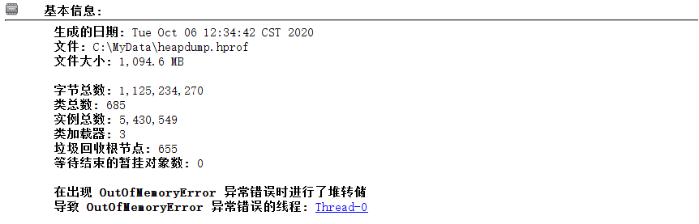

用VisualVM装入分析，在“概要”标签下的基本信息栏可以看到堆dump的生成日期、大小等信息以及异常的简要信息，如上图所示。

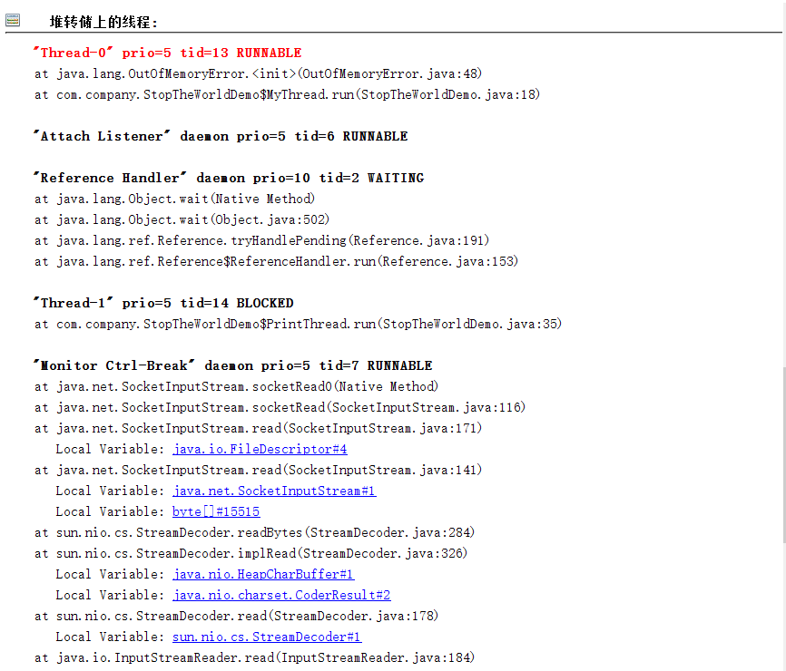

在“堆转储上的线程”栏可以看到应用程序崩溃时的详细异常信息，由上图可知，导致崩溃的原因是线程“Thread-0”发生OOM了，定位到StopTheWorldDemo的第18行代码，即“b1 = new byte[512];”，可知此时由于给b1分配内存所以发生了OOM错误。

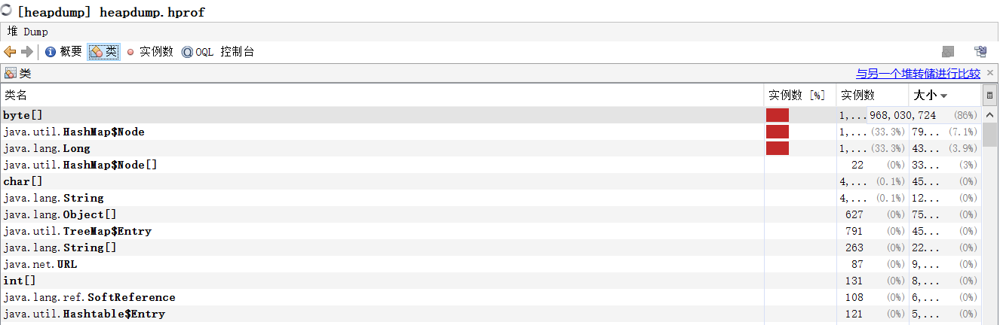

“类”标签下可以看到崩溃时各个类实例占用的堆内存大小，由上图可知，由于byte数组的不断分配，堆内存空间（总量1g）不足，因此应用程序抛出OOM错误。

### VisualVM的VisualGC插件


## 参考资料

G1概念：

[https://www.oracle.com/technical-resources/articles/java/g1gc.html](https://www.oracle.com/technical-resources/articles/java/g1gc.html)

[https://juejin.im/post/6844903953004494856#heading-26](https://juejin.im/post/6844903953004494856#heading-26)

三色标记法：

[https://en.wikipedia.org/wiki/Tracing\_garbage\_collection#Tri-color\_marking](https://en.wikipedia.org/wiki/Tracing_garbage_collection#Tri-color_marking)

G1日志分析：

[https://blogs.oracle.com/poonam/understanding-g1-gc-logs](https://blogs.oracle.com/poonam/understanding-g1-gc-logs)

[https://www.redhat.com/en/blog/collecting-and-reading-g1-garbage-collector-logs-part-2?source=searchresultlisting](https://www.redhat.com/en/blog/collecting-and-reading-g1-garbage-collector-logs-part-2?source=searchresultlisting)

参考书籍：

《JVM G1源码分析和调优》

《深入理解Java虚拟机：JVM高级特性与最佳实践-第三版》